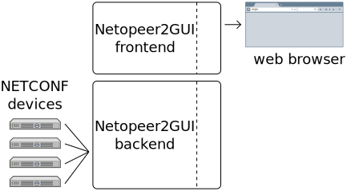
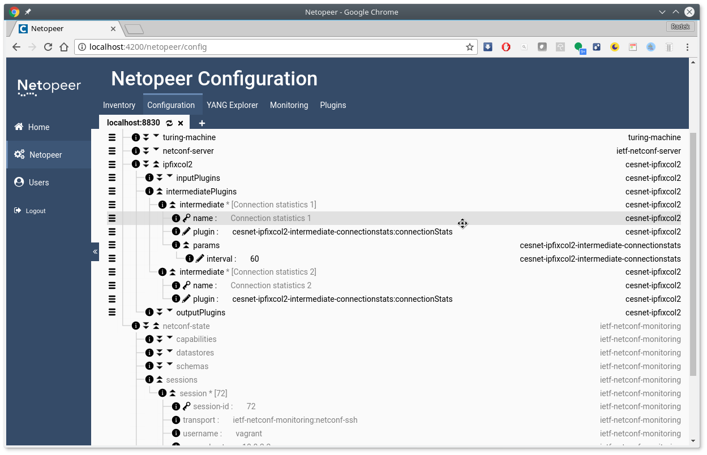

# Netopeer2GUI
Web-based NETCONF management center

This tool is currently under development and not intended for production use.
However, we welcome your feedback provided via the [issue tracker](https://github.com/CESNET/Netopeer2GUI/issues).



Several screenshots can be found in the [`docs`](./docs/).

# Features List

- [x] manage devices to connect to
  - [ ] manage devices groupings for bulk configuration
- [x] manage YANG schemas stored in GUI to represent received data
  - [ ] interaction with user by asking unknown module used by the connected device
- [x] display configuration and data of the connected device (data tree view)
- [x] edit configuration data of the device
- [ ] bulk configuration (set configuration of multiple device at once)
- [x] YANG explorer to display/browse YANG schema (currently just basic textual information)
- [ ] receive NETCONF notifications and present them to user
- [ ] accept NETCONF Call Home connections
- [ ] plugin interface for schema-specific applications

# Dependencies
The application is created as a module to the [liberouter-gui](https://github.com/CESNET/liberouter-gui)
framework, so to install it, follow the [liberouter-gui instructions](https://github.com/CESNET/liberouter-gui/wiki/Deploying-LiberouterGUI). When you decide to deploy production version, there is pre-built Netopeer2GUI as a [release package](https://github.com/CESNET/Netopeer2GUI/releases). To configure your web server, please follow the mentioned liberouter-gui instructions or have a look at [`*-release` vagrant image(s)](./vagrant/).

The backend is a Flask server written in Python 3 and utilizing [libyang](https://github.com/CESNET/libyang)
and [libnetconf2](https://github.com/CESNET/libnetconf2) Python bindings.
Unfortunatelly, the code of the bindings is not yet finished, so please use
the devel branches of the mentioned libraries:
```
$ git clone -b devel https://github.com/CESNET/libyang
$ mkdir -p libyang/build && cd libyang/build
$ cmake -DGEN_LANGUAGE_BINDINGS=ON ..
$ make
# make install
```
```
$ git clone -b devel https://github.com/CESNET/libnetconf2
$ mkdir -p libnetconf2/build && cd libnetconf2/build
$ cmake -DENABLE_PYTHON=ON ..
$ make
# make install
```

Or alternatively install binary packages of [libyang](https://software.opensuse.org//download.html?project=home%3Aliberouter&package=libyang-experimental) and [libnetconf2](https://software.opensuse.org//download.html?project=home%3Aliberouter&package=libnetconf2-experimental).

# Vagrant
For fast and simple testing/development deployment, you can use the prepared
Vagrantfiles for instantiating virtual machine. More information can be found
[here](./vagrant/).

